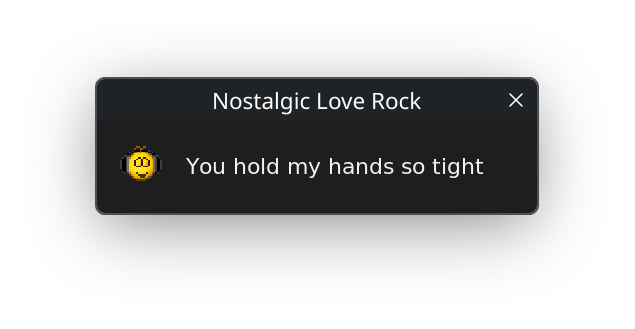

# HoverLyrics


Ventana emergente que muestra la **letra de la canción que está sonando en
Spotify**, una línea por vez: la ventana se abre, se cierra al terminar la línea
y se vuelve a abrir con la siguiente. A la izquierda va un gif (o png, webp,
jpg…) que sale de una carpeta según el **perfil** elegido.



## Índice

- [Qué hace](#qué-hace)
- [Requisitos](#requisitos)
- [Compilar](#compilar)
- [Crear la app de Spotify](#crear-la-app-de-spotify)
- [Uso](#uso)
- [Estructura](#estructura)
- [config.json](#configjson)
- [Cómo funciona](#cómo-funciona)
- [Diferencias por sistema](#diferencias-por-sistema)
- [Verificación](#verificación)
- [Licencia](#licencia)

## Qué hace

- Muestra **una línea de la letra por ventana**, sincronizada con lo que suena.
- El gif de la izquierda sale de la carpeta del **perfil** activo. Elegís el
  perfil en `config.json` y podés cambiarlo al vuelo con el **clic derecho**.
- **Clic izquierdo** en el gif → otra imagen al azar del mismo perfil.
- La ventana tiene **tema claro, oscuro, del sistema o colores propios**, y se
  puede arrastrar (recuerda dónde la dejaste).
- **No roba el foco** al aparecer, así no te interrumpe mientras hacés otra cosa.

## Requisitos

- Un compilador con **C++17** y **CMake 3.21+**.
- **Qt 6.5 o superior** (módulos `Widgets` y `Network`).

Es la única dependencia externa: con Qt alcanza para las ventanas, los gifs y
webp animados, el HTTP, el JSON, el hash SHA-256 del login y el servidor local
del callback. No hace falta instalar nada más.

<details>
<summary>Cómo instalar Qt 6</summary>

- **Debian/Ubuntu**: `sudo apt install qt6-base-dev`
- **Fedora**: `sudo dnf install qt6-qtbase-devel`
- **Arch**: `sudo pacman -S qt6-base`
- **macOS**: `brew install qt`
- **Windows**: el instalador de [qt.io](https://www.qt.io/download-qt-installer)
  (marcá *Qt 6.x → MSVC 64-bit*) o `vcpkg install qtbase`.

</details>

> [!NOTE]
> `nlohmann/json` se descarga solo con CMake en la primera configuración (para
> guardar `config.json` respetando el orden de los perfiles). No hay que hacer
> nada a mano.

## Compilar

```bash
cmake -S . -B build -DCMAKE_BUILD_TYPE=Release
cmake --build build -j
```

Queda el binario en `build/hoverlyrics` (`build/hoverlyrics.exe` en Windows).

## Crear la app de Spotify

1. Entrá a <https://developer.spotify.com/dashboard> e iniciá sesión.
2. **Create app**. El nombre y la descripción son lo que quieras.
3. En **Redirect URIs** agregá exactamente esta, sin nada más:

   ```
   http://127.0.0.1:8888/callback
   ```

4. En **APIs used** marcá **Web API**.
5. Guardá y copiá el **Client ID**.

> [!IMPORTANT]
> El **Client Secret no se usa**: el login es OAuth PKCE, que para una app de
> escritorio funciona solo con el Client ID. No lo pegues en ningún lado.

La primera vez el programa te pide el Client ID por terminal y lo guarda en
`.env`, junto al proyecto.

> [!WARNING]
> El login usa el puerto **8888**, así que tiene que estar libre: si algo lo
> ocupa, la autorización falla. Liberalo y reintentá.

## Uso

Corré el binario **desde la carpeta del proyecto** (ahí busca `config.json`,
`.env`, `token.json` y `gifs/`):

```bash
./build/hoverlyrics
```

La primera vez abre el navegador para que autorices la app. Después, con Spotify
reproduciendo algo:

| Acción | Qué hace |
|---|---|
| **Arrastrar** la ventana | la mueve; la posición se recuerda |
| **Clic izquierdo** en el gif | otra imagen al azar del perfil activo |
| **Clic derecho** en el gif | pasa al siguiente perfil y lo guarda |
| **X** de la ventana, o `Ctrl+C` | cierra el programa |

> [!TIP]
> Para que no tengas que ir a la carpeta, `cd` ahí una vez y creá un alias, o
> compilá con `-DCMAKE_RUNTIME_OUTPUT_DIRECTORY` apuntando donde lo quieras
> correr.

## Estructura

```
CMakeLists.txt   build: Qt 6 (Widgets + Network) y nlohmann/json
captura.png      la captura de arriba

src/
  main.cpp       entrada: --selftest y arranque
  config.cpp     .env, config.json, perfiles, temas
  system.cpp     diferencias entre Windows, Linux y macOS
  spotify.cpp    login OAuth PKCE y estado de reproducción
  lyrics.cpp     letra sincronizada (lrclib.net)
  images.cpp     elegir las imágenes de los perfiles
  window.cpp     la ventana de Qt

gifs/            una carpeta por perfil
```

Al primer arranque se crean tres archivos más, en la carpeta del proyecto:

| archivo | qué guarda |
|---|---|
| `config.json` | los perfiles y los ajustes de la ventana |
| `.env` | el Client ID de Spotify |
| `token.json` | el token de la sesión |

## config.json

Todo lo editable vive en un solo archivo:

```json
{
  "perfil": "default",
  "perfiles": {
    "default": "gifs/default",
    "sad": "gifs/sad",
    "romantic": "gifs/romantic",
    "fun": "gifs/fun"
  },
  "ventana": {
    "tema": "oscuro",
    "colores": {},
    "ancho": 440,
    "alto": 92,
    "fuente": ["DejaVu Sans", 11],
    "icono_px": 45,
    "icono_margen": 20,
    "icono_dy": 4,
    "texto_gap": 22,
    "texto_margen": 12,
    "margen_y": 10,
    "siempre_arriba": true
  }
}
```

Si al archivo le falta alguna clave, se completa con el valor por defecto y se
escribe de vuelta, así siempre ves todas las opciones disponibles.

### Perfiles

Cada perfil es un nombre a elección que apunta a una carpeta. Ponés las
imágenes donde quieras y elegís el perfil con `"perfil"`; no dependen de la
canción ni del nombre de la carpeta.

Acepta los formatos que abre Qt: `.gif`, `.webp` (también animados), `.png`,
`.jpg`, `.jpeg`, `.bmp`, `.tiff`.

- `icono_px` es la **caja** donde entran: cada imagen se escala sin deformarse y
  se centra.
- Cada gif se reproduce **a su propio ritmo** (se respeta la duración de cada
  frame).
- Se elige **una imagen al azar por canción** y se mantiene hasta que cambie el
  tema. Si el perfil no existe o su carpeta está vacía, cae a `default`.

> [!TIP]
> Para agregar un perfil nuevo, creá la carpeta dentro de `gifs/` y sumá la
> entrada en `"perfiles"`. El clic derecho va rotando en el orden en que estén
> escritos.

### Tema y colores

`"tema"` acepta `"oscuro"`, `"claro"` o `"sistema"` (detecta el tema del
escritorio).

Para colores propios, llená `"colores"`; pisan lo que traiga el tema:

```json
"tema": "sistema",
"colores": { "fondo": "#2b0a3d", "texto": "#ffd166" }
```

El resto son medidas en píxeles: `ancho`/`alto` de la ventana, `icono_px` (lado
de la caja de la imagen), `icono_margen` (al borde izquierdo), `icono_dy` (cuánto
se sube la imagen para centrarla con el texto), `texto_gap` (espacio entre
imagen y letra), `texto_margen`, `margen_y`, `fuente` (`[familia, tamaño]`) y
`siempre_arriba`.

> [!NOTE]
> Los cambios se aplican al reiniciar el programa. Si traés un `config.json` de
> otro sistema y la fuente no existe, cae sola a la del sistema.

## Cómo funciona

Un solo hilo y dos temporizadores, sobre el bucle de eventos de Qt:

- cada **400 ms** se le pregunta a Spotify (red, asíncrono: nunca bloquea);
- cada **100 ms** se recalcula qué línea toca y se dibuja.

Como la letra ya viene con el tiempo de cada línea, la ventana extrapola la
posición entre consulta y consulta y solo se corrige con lo que reporta Spotify.
Por eso el cambio de línea se siente al instante.

## Diferencias por sistema

Con Qt casi todo es una sola API en las tres plataformas:

| | Cómo se resuelve |
|---|---|
| **No robar foco** | `Qt::WindowDoesNotAcceptFocus` |
| **Tema `sistema`** | `QStyleHints::colorScheme()` |
| **Fuente por defecto** | Segoe UI (Windows), Helvetica Neue (macOS), DejaVu Sans (Linux) |
| **Ventana sin entrada en la barra** | `Qt::Tool` |

El gif animado, el webp, el HTTP, el login y el servidor del callback también
son iguales en los tres.

> [!NOTE]
> El soporte de Windows está implementado pero todavía no se probó en una
> máquina real.

## Verificación

```bash
./build/hoverlyrics --selftest
```

Corre los chequeos internos (parseo de la letra, config, temas, perfiles y el
control de errores repetidos) sin necesidad de red ni de abrir la ventana.

## Licencia

MIT — ver [`LICENSE`](LICENSE). Hecho por **Alexis González**
([@elJulioDev](https://github.com/elJulioDev)).
